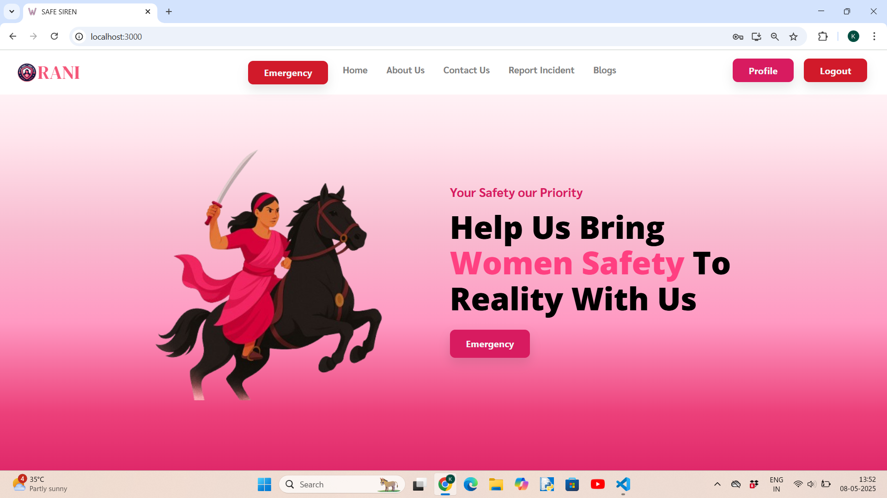

# 👑 RANI — Real-time Alert and Navigation Interface

### 🏆 3rd Place Winner at HMRITM Tech Fest Project Exhibition Challenge

RANI is a women's safety web application developed as part of the Tech Fest Project Exhibition at HMRITM. Among numerous teams from various colleges, secured **3rd position** by presenting a powerful solution aimed at enhancing safety for women through real-time alerts and intelligent navigation features.

---

## 📌 Overview

RANI provides a robust platform for women to **send distress signals**, **report incidents**, and **receive rapid assistance** in emergencies. By utilizing geolocation, real-time databases, and integrated communication tools, RANI ensures that users receive help when it matters most.

---

## 🚨 Key Features

- **📍 One-Tap Distress Signal**
  - Users can trigger a distress alert that fetches their real-time location.
  - Immediate notifications are sent to emergency contacts and all users in the **same PIN code**.
  - A map with location coordinates is shared via email.

- **📝 Incident Reporting**
  - Users can fill a detailed form to report any safety-related incidents.
    
- **📊 Admin Dashboard**
  - Admins can log in to a secure panel to monitor, review, and manage all incidents and distress alerts.
  - Supports incident filtering and status updates.

- **📡 Real-Time Alerts with Pincode Matching**
  - Notifications are dynamically sent to nearby users (within the same PIN code area) for crowd-sourced safety awareness.

- **📰 Blog Section**
  -  Informative articles and resources on women’s safety, legal rights, and self-defense tips..
    
- **🏢 NGO Contacts**
  - List of verified NGOs users can contact for help, counseling, and rescue.

---

## 🛠 Technologies Used

- **Frontend**: React.js + Tailwind CSS
- **Backend**: Node.js + Express.js
- **Database**: MongoDB (Mongoose)
- **Real-Time Location & Notification**: HTML5 Geolocation API + EmailJS/Nodemailer
- **Authentication**: JWT-based login system for both users and admins

---
## 🚀 Getting Started
Follow these steps to set up and run the RANI project locally:

## 1️⃣ Clone the Repository
- git clone https://github.com/Khushibansal777/Women-Safety-.git
- cd WomenSafetyWebApp-main
## 2️⃣ Install Backend Dependencies
- cd server
- npm install
## 3️⃣ Install Frontend Dependencies
- cd ../WomenSafetyWebApp-main
- npm install
## 4️⃣ Configure Environment Variables
- Create a .env file inside the /server directory with the following fields:
- MONGO_URI=your_mongo_connection_string
- EMAIL_USER=your_email@example.com
- EMAIL_PASS=your_email_password
- JWT_SECRET=your_jwt_secret
## 5️⃣Start the Backend Server
- cd server
- npm start 
## 6️⃣ Start the Frontend
- cd ../WomenSafetyWebApp-main
- npm start
## 7️⃣ Access the Application
Visit:
-http://localhost:3000

## 🧪 Usage
### 👤 Users:

Register/login to access features

Trigger emergency alerts via SOS

Report incidents with details and media

###  Admins:

Access the /admin route

View/manage user alerts and incident reports

Monitor real-time reports and stored media

### Screenshot

